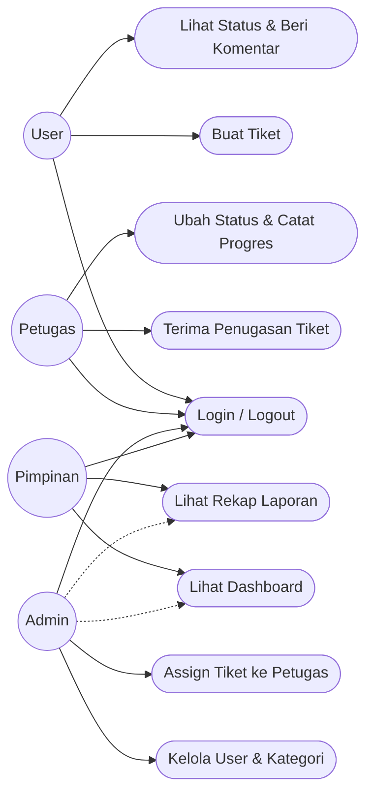
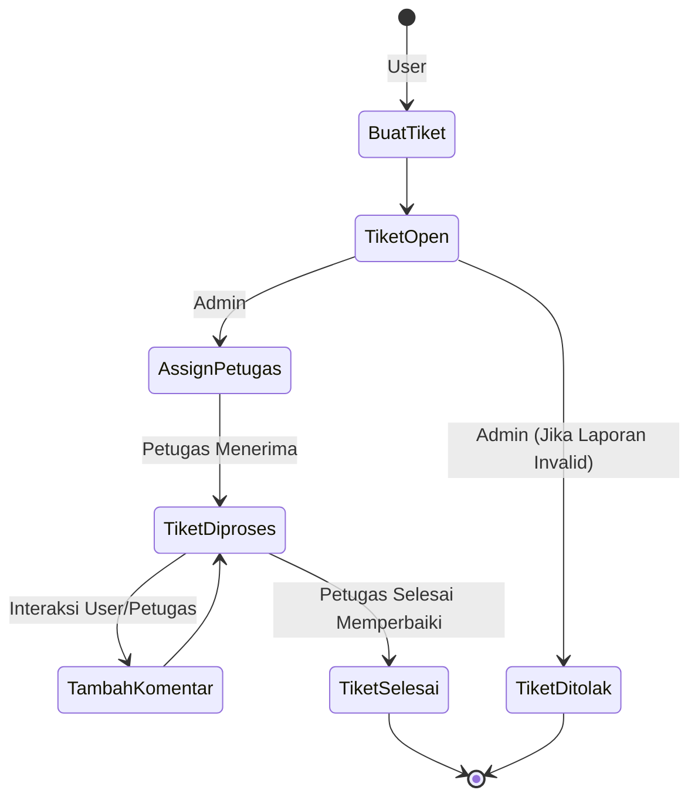
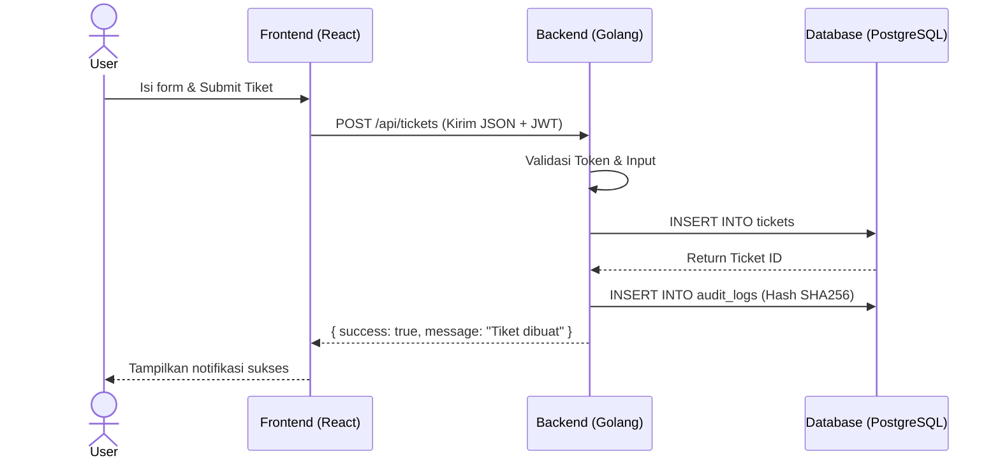
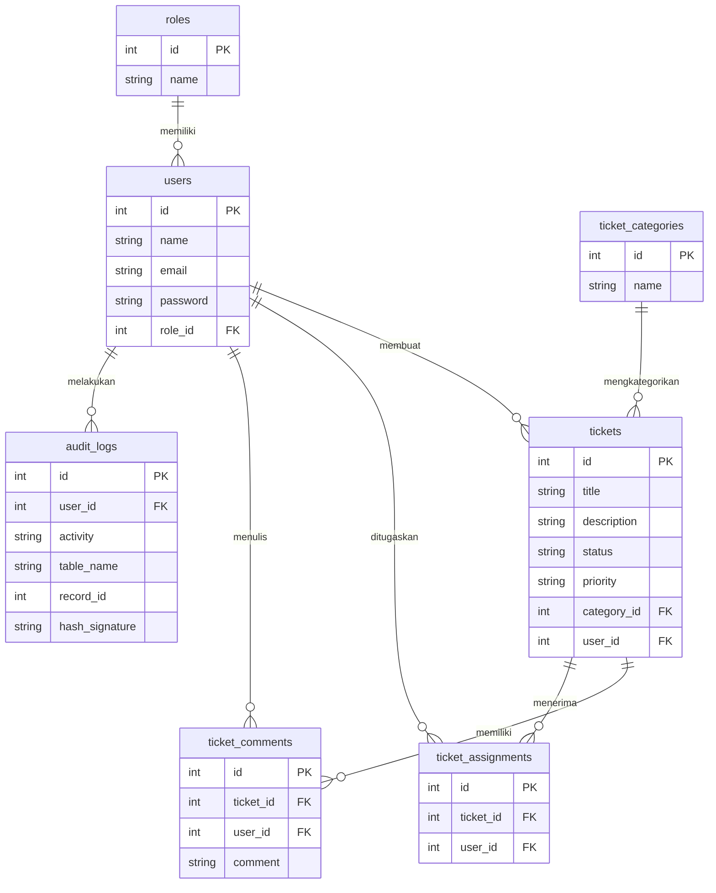

# BLUEPRINT PROJECT SIHELP (Kerja Praktik)
**Sistem Informasi Helpdesk dan Ticketing Layanan**

Dokumen ini merupakan rancangan (blueprint) untuk project SIHELP yang difokuskan pada pemenuhan tugas Kerja Praktik (KP) atau magang. Sistem dirancang agar fungsional, profesional, namun tetap sederhana, realistis, dan mudah diimplementasikan dalam waktu 2 hingga 3 bulan. 

Project ini sekaligus menjadi bukti penerapan dari berbagai mata kuliah Teknik Informatika, antara lain: Cybersecurity, Kapita Selekta, Keamanan Data dan Blockchain, Kerja Praktik, Kewirausahaan, Pancasila, dan Sistem Terdistribusi.

---

## 1. Latar Belakang
Dalam banyak instansi, kampus, maupun organisasi kecil, proses pelaporan masalah (misalnya kerusakan fasilitas atau error pada sistem IT) masih dilakukan secara manual melalui pesan instan atau lisan. Hal ini menyebabkan laporan sulit dilacak, progres penanganan tidak jelas, dan pimpinan kesulitan mengevaluasi kinerja teknisi. SIHELP hadir sebagai solusi digital untuk mencatat, mengelola, dan memantau tiket layanan secara terpusat agar proses penanganan masalah menjadi lebih tertib dan transparan.

## 2. Tujuan Project
1. Mempermudah pencatatan laporan masalah secara digital.
2. Mempermudah admin dalam mengklasifikasikan dan mengelola tiket masuk.
3. Mempermudah petugas/teknisi dalam menangani laporan secara terstruktur.
4. Mempermudah user (pelapor) dalam melacak status tiket mereka.
5. Menyediakan dashboard sederhana untuk monitoring operasional.
6. Menyediakan laporan tiket untuk keperluan evaluasi.
7. Menyediakan jejak aktivitas (audit log) sederhana sebagai bentuk pertanggungjawaban.
8. Menghasilkan luaran project Kerja Praktik yang aplikatif dan mudah dipresentasikan.

## 3. Analisis Kebutuhan Sistem
Sistem membutuhkan aplikasi web yang dapat diakses secara responsif (mendukung desktop dan mobile). Aplikasi harus membedakan hak akses secara tegas, memfasilitasi komunikasi ringan (komentar pada tiket), serta mencatat setiap perubahan kritis (audit log) ke dalam database untuk menjamin integritas riwayat layanan.

## 4. Functional Requirements
- **Manajemen Akun:** Sistem mengelola Login, Logout, dan penyimpanan profil sederhana.
- **Manajemen User & Role:** Super Admin/Admin dapat menambah, mengubah, dan menghapus data user.
- **Manajemen Kategori:** Admin dapat mengelola kategori masalah (Jaringan, Hardware, dll).
- **Manajemen Tiket:** User dapat membuat tiket; Admin dapat mengubah status dan menugaskan tiket; Petugas dapat mengupdate progres tiket menjadi 'Diproses' atau 'Selesai'.
- **Komentar:** User dan petugas dapat berinteraksi memberikan catatan progres melalui fitur komentar pada tiket.
- **Dashboard & Laporan:** Sistem menampilkan ringkasan data statistik tiket (Total Open, Selesai, dll) serta fitur ekspor laporan sederhana.
- **Audit Log:** Sistem otomatis mencatat aktivitas krusial pengguna dengan penambahan *hash* SHA256 sederhana untuk validasi keaslian rekaman.

## 5. Non-Functional Requirements (Sederhana)
- **Keamanan:** Autentikasi menggunakan JWT dan penyimpanan kata sandi menggunakan Bcrypt. Akses API divalidasi berdasarkan *Role-Based Access Control* (RBAC).
- **Performa:** Aplikasi dapat merespons permintaan umum dalam waktu kurang dari 1 detik.
- **Ketersediaan:** Di-*deploy* secara sederhana menggunakan Docker Compose pada *Ubuntu Server* pribadi.
- **Integritas:** Data *audit log* menggunakan hashing untuk menjaga rekam jejak.

## 6. Stakeholder
1. **User (Pelapor):** Mahasiswa, pegawai, atau klien yang melaporkan masalah.
2. **Admin (Dispatcher):** Staf yang bertugas memverifikasi tiket dan membagi tugas.
3. **Petugas (Teknisi):** Pihak yang terjun langsung memperbaiki masalah.
4. **Pimpinan (Manager):** Pihak yang mengevaluasi performa penanganan masalah melalui dashboard.

## 7. Role dan Hak Akses
| Fitur / Modul | Admin | Petugas | User | Pimpinan |
| :--- | :---: | :---: | :---: | :---: |
| **Login / Logout** | ✅ | ✅ | ✅ | ✅ |
| **Kelola User & Kategori** | ✅ | ❌ | ❌ | ❌ |
| **Buat Tiket** | ✅ | ❌ | ✅ | ❌ |
| **Lihat Tiket** | Semua | Yang Ditugaskan | Milik Sendiri | Semua (View Only) |
| **Assign Tiket** | ✅ | ❌ | ❌ | ❌ |
| **Ubah Status Tiket** | ✅ | ✅ | ❌ | ❌ |
| **Komentar Tiket** | ✅ | ✅ | ✅ | ❌ |
| **Lihat Dashboard & Laporan**| ✅ | ❌ | ❌ | ✅ |

---

## 8. Use Case Diagram



## 9. Activity Diagram (Siklus Tiket Sederhana)



## 10. Sequence Diagram (User Membuat Tiket)



## 11. ERD (Entity Relationship Diagram)



## 12. Struktur Database PostgreSQL
Sistem memuat 7 tabel utama minimal yang dirancang menggunakan GORM (Golang Object Relational Mapping):
1. **roles**: Menyimpan definisi akses (`Admin`, `Petugas`, `User`, `Pimpinan`).
2. **users**: Menyimpan data akun pengguna dan `role_id`, di mana `password` sudah di-hash (Bcrypt).
3. **ticket_categories**: Menyimpan *master data* kategori seperti *Jaringan*, *Software*, *Hardware*.
4. **tickets**: Tabel transaksi utama untuk menyimpan informasi masalah, `status` (Open, Diproses, Selesai, Ditolak), dan `priority`.
5. **ticket_comments**: Menyimpan obrolan atau catatan progres dari sebuah tiket.
6. **ticket_assignments**: Menghubungkan tabel *tickets* dengan tabel *users* (khususnya *Petugas*).
7. **audit_logs**: Menyimpan riwayat aktivitas penting. Struktur kolom: `id`, `user_id`, `activity`, `table_name`, `record_id`, `hash_signature`, dan `created_at`.

## 13. Struktur Folder Frontend (React + Vite)
```text
frontend/
├── src/
│   ├── assets/           (Gambar, Logo)
│   ├── components/       (Reusable UI: Navbar, Sidebar, Button, Table)
│   ├── pages/            (Halaman: Login, Dashboard, TicketList, TicketDetail)
│   ├── utils/            (Konfigurasi Axios, helper JWT)
│   ├── App.jsx           (Konfigurasi React Router)
│   └── main.jsx          (Entry point)
├── index.html
├── package.json
└── vite.config.js
```

## 14. Struktur Folder Backend (Golang + Echo)
```text
backend/
├── main.go               (Entry point server Echo)
├── config/               (Load variabel .env & inisiasi GORM)
├── controllers/          (Logic API: AuthController, TicketController)
├── models/               (Definisi struct database GORM)
├── routes/               (Pendaftaran endpoint Echo)
├── middlewares/          (JWT Auth, Role checking)
├── utils/                (Helper untuk hashing password & SHA256 audit log)
├── go.mod
└── go.sum
```

## 15. Daftar REST API

**Auth:**
- `POST /api/login` (Mendapatkan token JWT)
- `POST /api/logout` (Menghapus sesi/token di klien)
- `GET /api/profile` (Mendapatkan data user aktif)

**Users (Admin Only):**
- `GET /api/users`
- `POST /api/users`
- `PUT /api/users/:id`
- `DELETE /api/users/:id`

**Tickets:**
- `GET /api/tickets` (Menampilkan daftar tiket dengan query params filter)
- `POST /api/tickets` (User membuat tiket baru)
- `GET /api/tickets/:id` (Detail tiket)
- `PUT /api/tickets/:id` (Edit informasi tiket)
- `PATCH /api/tickets/:id/status` (Petugas/Admin update status)
- `PATCH /api/tickets/:id/assign` (Admin menugaskan teknisi)
- `DELETE /api/tickets/:id` (Admin menghapus tiket)

**Categories:**
- `GET /api/categories`
- `POST /api/categories`
- `PUT /api/categories/:id`
- `DELETE /api/categories/:id`

**Comments:**
- `GET /api/tickets/:id/comments` (Mengambil diskusi sebuah tiket)
- `POST /api/tickets/:id/comments` (Kirim komentar)

**Dashboard & Reports:**
- `GET /api/dashboard/summary` (Mengambil total statistik)
- `GET /api/dashboard/chart` (Mengambil data array untuk Chart.js)
- `GET /api/reports/tickets` (Data untuk di-export/dicetak)
- `GET /api/audit-logs` (Melihat riwayat log sistem)

## 16. Desain Dashboard
Dashboard menggunakan **Tailwind CSS** dan **Chart.js** dengan tampilan sederhana dan fungsional:
- **Top Cards (Widget):** 
  1. Total Tiket (Keseluruhan)
  2. Tiket Open (Butuh tindakan)
  3. Tiket Diproses (Sedang ditangani)
  4. Tiket Selesai (Selesai dengan sukses)
- **Grafik Bar/Line:** "Jumlah Tiket Masuk per Bulan".
- **Grafik Pie/Doughnut:** "Proporsi Tiket Berdasarkan Kategori" (misal: 40% Jaringan, 60% Software).
- **Tabel Singkat:** "5 Tiket Terbaru yang Masuk" (Hanya untuk Admin/Pimpinan).

## 17. Roadmap Pengerjaan 2 - 3 Bulan

**Bulan 1: Perancangan & Fondasi Backend**
- Minggu 1: Analisis kebutuhan detail, penyempurnaan UI/UX, inisialisasi basis data PostgreSQL.
- Minggu 2: Setup Golang Echo, implementasi *Auth* (JWT & Bcrypt).
- Minggu 3: CRUD *User*, *Role*, dan *Category*.
- Minggu 4: CRUD *Ticket*, sistem relasi, dan *Audit Log* sederhana (dengan SHA256).

**Bulan 2: Pengembangan Frontend & Integrasi**
- Minggu 1: Setup React Vite, perancangan layout dasar (Sidebar, Navbar, Routing).
- Minggu 2: Pembuatan halaman Login, manajemen User, dan manajemen Kategori.
- Minggu 3: Implementasi pembuatan Tiket, detail tiket, dan sistem Komentar.
- Minggu 4: Implementasi *Role-Based Access Control* di UI (menyembunyikan menu yang tidak relevan).

**Bulan 3: Dashboard, Testing & Deployment**
- Minggu 1: Integrasi Chart.js untuk Dashboard dan pembuatan halaman Laporan.
- Minggu 2: *Testing* skenario fungsional dan *bug fixing*.
- Minggu 3: Penyiapan `docker-compose.yml` (Frontend, Backend, PostgreSQL).
- Minggu 4: *Deployment* ke *Ubuntu Server* pribadi, presentasi hasil, dan penyusunan laporan KP.

## 18. Testing Sederhana
Pengujian difokuskan pada uji fungsional (Blackbox Testing) tanpa *automated test* (CI/CD) yang rumit:
1. **Test Login:** Memastikan user salah password tidak dapat masuk, dan token valid dapat dipakai mengakses fitur.
2. **Test Role Access:** Memastikan user biasa tidak bisa mengakses API `GET /api/users` milik Admin (harus mendapat pesan 403 Forbidden).
3. **Test Flow Tiket:** User buat tiket -> Admin assign -> Petugas ubah jadi "Diproses" -> Petugas beri komentar -> Petugas set "Selesai".
4. **Test Audit Log:** Melakukan perubahan tiket dan mengecek apakah baris di tabel `audit_logs` bertambah beserta hasil Hash SHA256-nya.

## 19. Kesimpulan
SIHELP versi Kerja Praktik ini adalah sistem yang efisien dan memadai untuk memenuhi kebutuhan riil pencatatan pelaporan masalah di instansi berskala menengah ke bawah. Arsitektur yang diusung sangat logis, memisahkan logika antarmuka (React) dan sistem terpusat (Golang), sehingga merepresentasikan standar industri *software development* moderen tanpa memberikan kompleksitas berlebih. Aplikasi ini memfasilitasi audit log sebagai nilai tambah keamanan sistem, dan *Dashboard* interaktif sebagai nilai fungsional bagi pengambil keputusan.

## 20. Saran Pengembangan
Karena project dibatasi oleh waktu Kerja Praktik, beberapa saran pengembangan untuk masa mendatang (misalnya untuk penelitian Skripsi) meliputi:
1. Menambahkan notifikasi Telegram/Email secara *real-time*.
2. Fitur *Knowledge Base* atau FAQ agar pelapor dapat mencari solusi sendiri sebelum membuat tiket.
3. Melakukan refaktorisasi arsitektur ke *Microservices* murni jika skala aplikasi berkembang pesat.
4. Menambahkan modul *Service Level Agreement* (SLA) otomatis yang akan memberikan peringatan jika teknisi terlambat menangani laporan.
